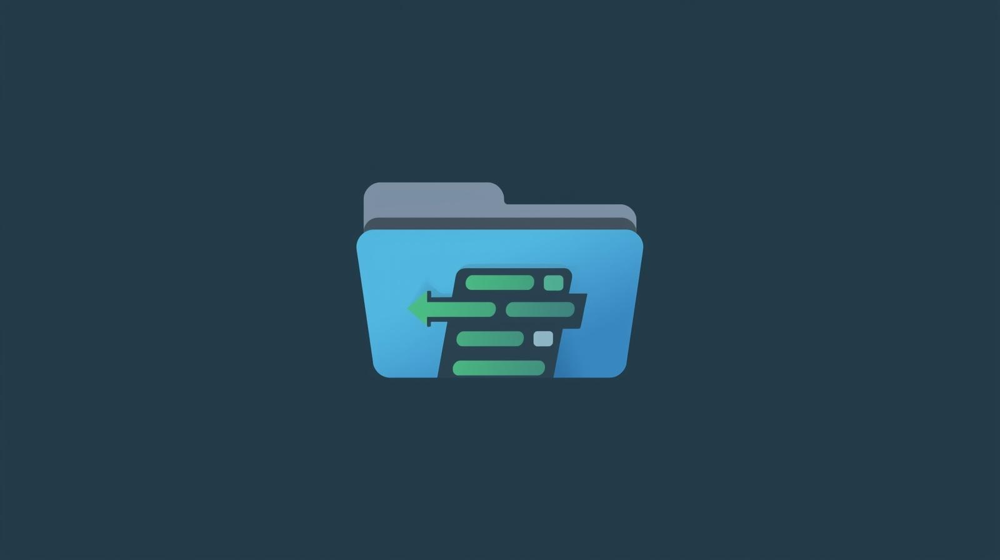
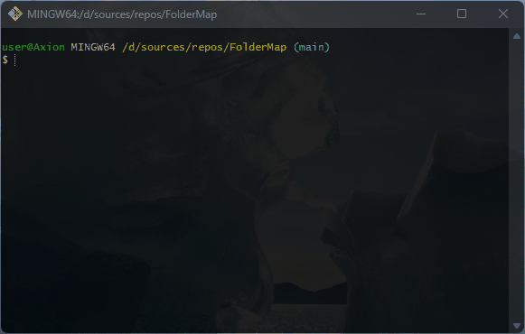

# FolderMap
Accepting paths and outputting folders and files, and operating on them, using appropriate console commands

## 💻 About program
*Commands*

- *all - Show all files and folders in this path*
- *back - Return from the current path*
- *move - Change folder path or enter any folder*
- *only - Show only files with the specified extensions*
- *tree - Show a tree of all in path*
- *find - Search for a file*
- *sort - Sort files by name, size and date*
- *files - Show files and operations on them*
- *name - Reads multiple names from Memory*
- *quit - Exit the program*

### 🪟 Preview

### ⚙️ Technologies
 

## 🧑‍💻 I worked on it
- *OOP princples: Abstraction, Encapsulation, Inheritance, Polymorphism*
- *Elements of OOP: classes, objects, interfaces, enums*
- *Classes: Console, ConsoleColor, ConsoleKey, DirectoryInfo, Enum, IEnumerable\<T>*
- *Data types: int, string, bool, DateTime*
- *Access modifiers: public, private*
- *LINQ methods: Where(), Contains(), Select(), FirstOrDefault()*
- *Object class methods: Equals(), ToString()*
- *Strings: Regular, Interpolation, Verbatim*
- *Looping statements: for, do while, while*
- *Condition statements: if else, switch*